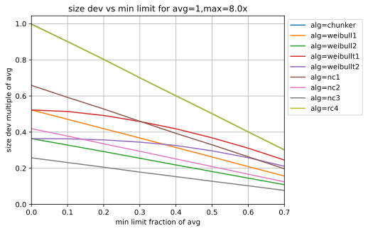
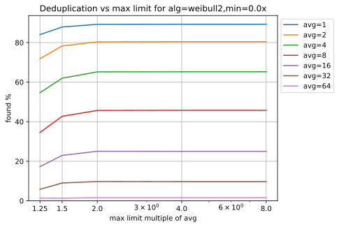
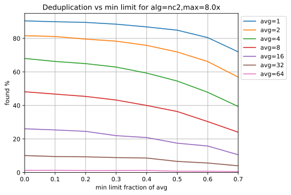
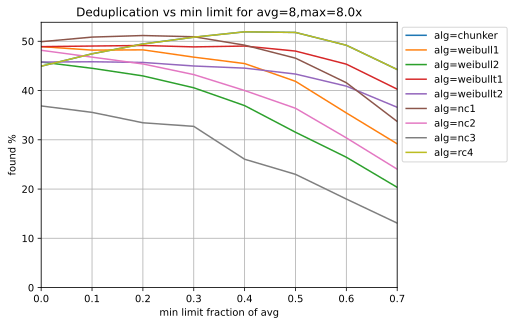
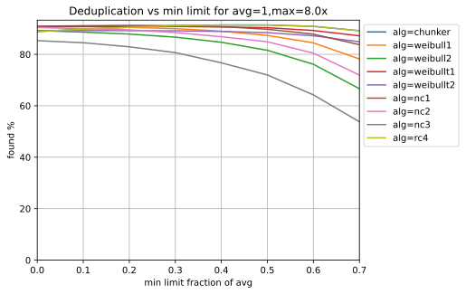
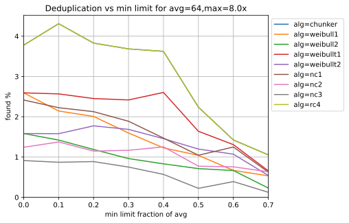
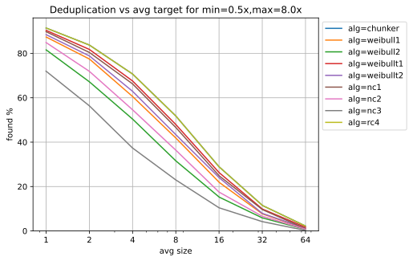

=============================
Chunker Performance Results
=============================

Overview
========

These are tests for different chunker distribution agorithms inspired by the
'normalized chunking' in `FastCDC
<https://www.usenix.org/system/files/conference/atc16/atc16-paper-xia.pdf>`_,
and 'regression chunking' in `Primary Data Deduplication
<https://www.usenix.org/system/files/conference/atc12/atc12-final293.pdf>`_.
They test only the chunker distribution algorithms using a fast and flexible
judgement criteria with a simulated rollsum.

Rollsum Algorithms
------------------

These tests do not cover any rollsum implementations and simulate a rollsum as
producing a repeatable psedo-random stream of 32bit hashes. This should be
equivalent to an ideal rollsum, and allows the chunker distribution algorithms
to be assessed without being affected by weaknesses and degenerate cases in
real rollsum algorithms.

For a real rollsum there are several options. Testing and analysis of rollsums
can be found in the `dbaarda/rollsum-tests results
<https://github.com/dbaarda/rollsum-tests/blob/master/RESULTS.rst>`_.
CyclicPoly (AKA BuzzHash) is strong and fast but requires a mapping table.
RabinKarp (AKA PolyHash) is stronger and probably just as fast.
RabinFingerPrint is strong but very slow using lookup tables to implement
GF(2) operations. Adler32/Fletcher-based (AKA bup or rollsum) are fast but
very very weak for small sliding windows. Gear is fast and avoids the need to
keep a sliding window, but requires a mapping table and is not very strong.

A common problem with many rollsums like Adler32 and Gear is the
most-significant-bits are stronger than the least-significant-bits. Many
chunking algorithms naively use the least-significant-bits for the judgement
criteria. FastCDC uses Gear together with a "zero-padding" judgement criteria
to try and overcome the weakness in the lower bits and effectively increase
the sliding window size.

For chunking, Gear is probably the fastest and good enough provided you use
the upper bits. If a stronger hash or larger sliding window is needed,
PolyHash would be better. Buzzhash is also fine, but probably not as good as
PolyHash.

Note I've seen many FastCDC implementations based on `ronomon/deduplication
<https://github.com/ronomon/deduplication>`_ that uses a right-shift instead
of a left shift, so that the least-significant-bits have more entropy and the
hash judgement doesn't need "zero-padding" of the mask. This might be
problematic because it means bytes don't fully "expire" from the hash, so
bytes from the very start of the block can modify the hash. This is because
addition in the Gear rollsum also propogates some bit changes upwards, so the
shift-right might never fully expire a byte out of the hash. In some ways this
improves the entropy of the hash, but it also means a change early in a chunk
can change the break point at the end, messing with resynchronisation. I filed
a `bug about it <https://github.com/ronomon/deduplication/issues/7>`_. In
retrospect it is probably OK, because the chance of a changed old byte
impacting on bits in the hash quickly approaches zero. However it's important
to note that it makes the least-significant-bits the strong ones. It should
probably be tested to see if this ends up being better than using a left-shift.

Hash Judgement
--------------

The FastCDC paper claims that ``if !(hash & mask)`` is measurably faster than
``if (hash % tgt_len) == criteria`` for the hash judgement criteria. This may
be because ``mod`` operations are more expensive than ``and`` operations, but
provided tgt_len is a constant power of two most compilers should optimize it
to an ``and`` operation anyway. So most of the speed benefits must be because
under the hood the ``!(...)`` operation can simply check the zero-flag set by
the ``and`` operation, whereas ``(...) == criteria`` requires an extra
comparison operation.

In FastCDC they use a zero-padded mask to use higher bits of the Gear rollsum
to increase the sliding window size. However, we know that the Gear rollsum
includes more information in the most significant bits, so why not just use
the N most significant bits for a tgt_len=2^N expected size? It may be that
the bit selection they used avoids degenerate cases in the input or
byte->uint32 mapping they use, but I suspect not. Selecting the N most
significant bits can be done just as fast and simpler than FastCDC using a
shift::

  SHIFT = 32 - N

  if !(hash >> SHIFT):
    <it's a break point>

However comparing the hash to a threshold is also just as fast and capable of
arbitrary tgt_len sizes, not just powers of 2::

  THRESHOLD = 2^32 / tgt_len

  if (hash < THRESHOLD)
    <it's a break point>

This probably has stronger requirements for decent distribution of the hash
than a simple mask. In particular it requires that the top N bits of the hash
have a good distribution for tgt_len ~= 2^N. The Gear rollsum is known to not
have a great distribution for ASCII data, but fortunately the upper bits are
better, so it's probably OK for this purpose.

These tests use the "compare to a threshold' hash judgement since it's fast
and lets us test arbitrary target chunk lengths.

Chunk distribution
------------------

FastCDC pointed out that the simple chunker algorithm actually produces chunk
sizes with an exponential distribution that has average chunk size of
``avg_len = min_len + tgt_len``, so the tgt_len, which many people call the
average length, is not really the average length.

FastCDC introduced their "normalized chunking" algorithm to give a better
approximation of a normal distribution, and claimed it allowed for larger
min_len with more cut-point-skipping for speed without adversely affecting
deduplication.

This idea inspired me to investigate even better ways of getting a more normal
distribution of chunk sizes, but unfortunatley the results show this is always
at the expense of duplication.

The primary factor for improving deduplication is the average chunk size.
Reducing the number of long chunks, or tightening the distribution curve, does
help too, but not if it messes with the boundary selection criteria. Things
like reducing max_len or changing the judgement criteria mess with
synchronisation after changes.

Chunking Algorithms
===================

The chunking algorithms define how chunk boundaries are identified. They have
3 parameters;

* min_len - the minimum chunk length
* max_len - the maximum chunk length
* tgt_len - the "target chunk length" which depends on the algorithm.

The different algorithms effectively modify the chunk-length distribution by
using a different "hazzard function" that defines the probability of any
offset being a chunk boundary based on the chunk length.

The main driver on chunking speed is the min_len, since it defines how many
bytes can be skipped (cut-point skipping) after a chunk boundary before active
scanning for the next boundary starts. Increasing min_len from 0x to 0.5x the
average chunk length will make chunking 2x as fast. However, the duplication
detection is also modified by min_len, since skipping bytes can mask
break-points, messing with resynchronisation after changes. Typically there is
a sweet point balancing speed vs deduplication.

The max_len sets an upper limit on the chunk size, avoiding degenerate cases
and impractically large blocks by truncating them. It too affects
deduplication, particularly when combined with min_len, as it injects
non-content-based breakpoints that can then mask other break points. Ideally
it should be set to a size large enough that less than 1~2% of chunks are
truncated, based on the algorithm's distribution.

The tgt_len has different meanings for different algorithms, but modifies the
average length of the algorithm's distribution curve. The chunk average length
is the main driver for deduplication, with smaller chunks finding more
duplicates. Smaller chunks also mean more chunks and more per-chunk overheads.
There is usually a sweet point balancing deduplication vs chunk-size. Note
that min_len and max_len also modify the actual average length by "truncating"
the distribution curve, so the average is a function of min_len, max_len, and
tgt_len. The tgt_len and avg_len can be calculated from each other for a given
min_len and max_len.

The chunk length distribution also affects deduplication, and less longer
blocks in general improve deduplication. However, a changing hazzard function
that changes the distribution also changes the content-based interpretation of
breakpoints based on the chunk length, so content changes can also change the
evaluation of a breakpoint, messing with resynchronisation. Improving the
distribution could make deduplication better or worse, depending on the
algorithm.

Chunker
-------

This is the standard simple chunker with an exponential distribution. After
the min_len, there is a fixed probability that any could be a chunk boundary.
The tgt_len argument is the mean length of the exponential distribution, not
including the offset by min_len. The distribution's curves where x is measured
from min_len and L is the normal exponential distribution lambda parameter
are::

    f(x) = L
    CDF(x) = 1 - e^-(L*x)
    PDF(x) = L*e^-(L*x)
    avg_len = C + A*(1-e^-(L*T))

Where::

    A = tgt_len
    L = 1/A
    C = min_len
    T = max_len - min_len

NC
--

This is the "normalized chunking" described in the FastCDC paper with
different NC levels. The tgt_len for this chunker is the "target length" to
set the two different hazzard function probabilities of ``prob1 =
1/(tgt_len<<NC)`` and ``prob2 = 1/(tgt_len>>NC)``. The "transition point"
where the probability steps up from prob1 to prob2 is set to ``mid_len =
min_len + tgt_len/2``. Note that this copies what was evaluated in the FastCDC
paper.

The FastCDC paper is not entirely clear how it set things up for different
min_len values. It seems to have used a fixed 8K "normalized chunk size" for
the purpose of setting the hash judgement masks, and then set the transition
point to ``mid_len = min_len + 4K``. This is like setting the transition point
to half of the target length past min_len, which we copy here. However, this
is a little strange and unexplained given they evaluated normalized chunking's
distribution for min_len=0 with the transition point = target length.

Other common implementations based on https://github.com/ronomon/deduplication
set the hash judgment masks based on the target length, and set the transition
point to ``max(0, tgt_len - 1.5*min_len)``, which is also strange since it means
you only use the first mask if ``tgt_len > 2.5*min_len``, and FastCDC recommends
and gets it's speed benefits when ``tgt_len <= 2*min_len``.

The distribution's curves where x is measured from min_len and L is the normal
exponential distribution lambda parameter are::

    f(x) = L1, x<=T1
           L2, x>T1
    CDF(x) = 1 - e^-(L1*x), x<=T1
             1 - e^-(L1*T1 + L2*(x-T1)), x>T1
    PDF(x) = L1*e^-(L1*x), x<=T1
             L2*e^-(L1*T1 + L2*(x-T1)), x>T1
    avg_len = C + A1 - e^-(L1*T1) * (A1 - A2*(1-e^-(L2*T2)))

Where::

    mid_len = min_len + tgt_len/2
    A1 = tgt_len << NC
    A2 = tgt_len >> NC
    L1 = 1/A1
    L2 = 1/A2
    C = min_len
    T1 = mid_len - min_len
    T2 = max_len - mid_len

We test the three nc1 (NC=1), nc2 (NC=2), and nc3 (NC=3) levels evaluated in
the FastCDC paper.

Weibull
-------

This was an idea inspired by FastCDC's "normalized chunking" to give an even
better approximation to a normal distribution using a "hazzard function" that
increases with block lenght as a function ``f(x) = M * x^P``. This turns out
to be the same as a `Weibull Distribution
<https://en.wikipedia.org/wiki/Weibull_distribution>`_ with ``k=P+1``. Note
that P=0 (AKA k=1) is identical to the normal Chunker exponential
distribution. We name these Weibull
 where P is the power used in the
hazzard funciton.

The tgt_len for this chunker represents the distribution mean, not including
the effects of min_len and max_len. The distribution's curves where x is
measured from min_len and k and L are the normal Weibull parameters are::

    f(x) = M*x^P
    CDF(x) = 1 - e^-(M/k*x^k)
    PDF(x) = M*x^(k-1) * e^-(M/k*x^k)
    avg_len = C + L*gammalower((k+1)/k,(T/L)^k) + T*e^-((T/L)^k)

Where::

    k = P + 1
    L = tgt_len/gamma(1+1/k)
    M = k/L^k = b*k
    C = min_len
    T = max_len - min_len

WeibullT
--------

After initial tests showed that Weibull performed worse than Chunker with
large min_len values, I wondered if it would be better to "truncate" the
hazzard function to zero before min_len instead of shifting it and the
distribution to the right. This gives a modified Weibull distribution that
rises faster after min_len. This is identical to Weibull when min_len=0.  We
name these WeibullT
 where P is the power used in the hazzard funciton.

The tgt_len for this chunker represents the weibull distribution mean, not
including the effects of min_len and max_len. The distribution's curves, where
x is measured from min_len and k and L are the normal Weibull parameters,
are::

    f(x) = M*(x+C)^P
    CDF(x) = 1 - e^-(M/k*((x+C)^k - C^k))
    PDF(x) = M*(x+C)^(k-1) * e^-(M/k*((x+C)^k - C^k))
    avg_len = L*e^((C/L)^k) * (gammalower((k+1)/k, ((T+C)/L)^k) -
        gammalower((k+1)/k, (C/L)^k)) + (C+T)*e^-(((T+C)/L)^k - (C/L)^k)

Where::

    k = P + 1
    L = tgt_len/gamma(1+1/k)
    M = k/L^k
    C = min_len
    T = max_len - min_len

RC4
---

The `Primary Data Deduplication`_ paper introduces "Regression Chunking" as a
way to reduce the problems of max_len truncations. Instead of just truncating
chunks at max_len, it "goes back" looking for a chunk boundary before the
limit with a weaker boundary criteria. It uses bit-masks, and the weaker
criteria uses a mask with N-k bits for k=1..4. This is implemented by keeping
all the k=1..4 last weak-matches as it scans, then using the last of the
strongest matches found when it hits max_len. This has the effect of
re-destributing the tail max_len chunks over smaller chunk lengths, giving a
nearly uniform distribution according to their graphs.

Also worth noting is they use chunker settings min_len=32K, tgt_len=64K,
max_len=128K and get an average length of about 80K after Regression Chunking.
These settings are equivalent to about min_len=0.33x, max_len=1.33x, which is
a very low max_len setting. Their doc talks about this giving about 14%
truncations without regression chunking, but they seem to miss the fact that
min_len offsets the real average, and actually they would have got e^-1.5 =
22%, truncations which would make some kind of truncation handling
improvements even more necessary.

Figuring out the avg_len from tgt_len/min_len/max_len is tricky. It's similar
to simple Exponential Chunking except for how truncated blocks are handled.
For truncation, it doesn't just use max_len but instead uses a
reverse-exponential decay backwards from max_len with the judgement critieria
relaxed 2x. The tail of this reverse exponential distribution is then trucated
at min_len and redistributed using another reverse-exponential distribution
from max_len with the judgement criteria further relaxed 2x, and this is
repeated k times. Only the final truncation after k reverse-exponential
distributions is set to max_len. Note in theory the first reverse-distribution
should decay 2x as fast as the initial forward-exponential-distribution, but
since we already know that the range between min_len to max_len doesn't have
anything that matches the the initial judgement criteria, relaxing it 2x
actually gives us the same decay rate. Similarly for each iteration of the
reverse-distribution we already know that it doesn't match half of the 2x
relaxed judgement criteria. This gives the following equation for avg_len::

    d = e^(-T/A)
    avg_len = C + A - d*(T+A)
    for i in range(k):
      avg_len += d * (T - A*(1-d))
      A /= 2
      d *= d
    avg_len += d*T

Where::

    A = tgt_len
    C = min_len
    T = max_len - min_len

Except when tested, the avg_len was pretty consistently 10% larger than this
predicted for max_len=1.5x, min_len=0. As min_len increased, this prediction
got better, and for min_len>=0.6 it was accurate. It took a lot of thinking
and testing to figure out that this calculation doesn't take into account what
regressing back from max_len to an earlier weaker judgement criteria break
point does to the NEXT block. It means that the next block is known to not
have a break point that matches the stronger judgement criteria in the start
part that was regressed back over. This means there are less short blocks, and
behaves similar to an extra min_len setting, shifting the exponential
distribution to the right. This shifting also changes the fraction that gets
truncated and regressed, further impacting on the next block. For each
regression iteration, there is also an extra "regression truncation" at the
start of the block known to not contain any matches at the recursion's match
criteria, and this distance is different for each regression. Solving for this
effect is tricky, but can be approximated by a c additional offset to min_len,
and cr0..crN additional offsets for each regression. It looks a bit like
this::

Initial search
                        |----A------->                 < forward search
|<--------------------max_len----------------------->|
|<---C--->|<----------------T----------------------->|
          |<-----c----->|<-----------t-------------->|
          |<---------a--------------->|

1st regression
                                  <-----A1-----------| < backwards search
          |<---cr1--->|<------------t1-------------->|
          |<-------a1----------->|<--------r1------->|
                                |<---c1--->|<---C--->|

2nd regresson
                                    <-----A2---------| < backwards search
          |<--cr2-->|<--------------t2-------------->|
          |<----------a2---------->|<------r2------->|
                                  |<--c2-->|<---C--->|
        :                      :

nth regression
                                      <-----AN-------| < backwards search
          |<-crN->|<--------------tN---------------->|
          |<----------aN------------>|<-----rN------>|
                                    |<-cN->|<---C--->|

final result
|<--------------------avg_len------------>

Where::

    C = min_len
    T = max_len - min_len
    A : forward search target length.
      = tgt_len
    c : previous block total regression longer than C.
      = c1 + c2 + ... + cN
    t : initial match search length.
      = T - c
    d : probability of initial search not matching.
      = e^-(t/A)
    a : avg initial match length excluding regressions.
      = c + A - d*(T+A)
    Ak : kth regression backwards search target length.
       = A        ; k=1
         A(k-1)/2 ; k>1
    crk : avg previous block regression longer than C for kth regression,
        = ck + c(k+1) + c(k+2) + ... + cN
    tk : kth regression search length.
       = T - crk
    dk : probability of kth regression not matching.
       = e^-(tk/Ak)
    drk : probability of kth regression happening.
        = d * d1 * ... * d(k-1)
    dCk : probability of regressing longer than C for kth regression.
        = e^-(C/Ak)
    rk : regression length for kth regression.
       = Ak - dk*(tk+Ak)
    ak : avg length for kth regression.
       = drk*((1-dk)*T - rk)
    ck : avg regression longer than C for kth regression
       = drk * (dCk*Ak - dk*(tk - C + Ak))
    avg_len = C + a + a1 + a2 +...+ aN + dr(N+1)*T

Solving this for ``c`` (and all ``ck``) to get avg_len can be done iteratively.
However, testing shows that this gives a value for ``c`` that is about 15% too
big. This suggests there is still some missing factor or error. Fortunately
just adding in a 0.85 scaling factor for the ``ck`` values gives results
within 1% of this calculation.

Note that this regression undermines the speed benefits of cut-point-skipping
with a large min_len a bit, since scanning of the start of blocks is not fully
skipped, but is scanned as the end of the previous block before regression.
However, this only hurts when regression happens, which is less than 14% of
the time with min_len=0.5x, max_len=1.5x.

Testing
=======

Testing can be done using real-world usage tests, or synthetic simulation
tests. Real-world tests have the advantage of being representative of the
particular real-world use-case, but can be unrepresentative of other
real-world use-cases and are much harder to analyse. Synthetic tests can
specifically target known corner-cases and are much easier to analyse, making
it possible to more accurately assess the performance and make comparisons.

We use a synthetic test that generates a large 80000K run of initial "data",
which is then repeated with cyclic modifications. The modifications consist of
copy, insert, delete operations, with exponential random lengths of 16K, 8K,
and 4K respectively. The test runs until at least 2x the initial data is
processed and the last block is completed. This ensures that there is no
fractional tail block to mess with the block-length stats, but does mean that
different runs might process slightly different amounts of data.

This means we know exactly what duplicate bytes are in the data (aproximately
33.3%) and can thus accurately measure how much duplication was detected. The
average duplicate-run-length is 16K, with an average of 8K modified data
between each run.

Results
=======

For each test we have the following variables;

* algorithm: The chunking algorithm used.
* avg_len: The target average block length.
* min_len: The minimum length limit as a multiple of avg_len.
* max_len: The maximum length limit as a multiple of avg_len.

From the test runs can get the following data;

* performance: the percentage of duplicate data detected.
* size avg: the actual average block length.
* size dev: The standard deviation of block length.

How average size varies with average target
------------------------------------------

The average block size should be very close to the target average. If it
deviates significantly it would indicate that our tests have problematic
biases or insufficient random data. It also validates the maths we use for
calculating the target and average lengths.

.. image:: data/sizeavg-weibull2-x-t-8.0.svg

These show the average size is nearly always within 1% of the target average.
You can also see it increases with the increasing target average. This is
because for the same data size, larger chunk sizes means less chunks, giving
us less random data, so there is more random noise.

How size stddev varies with min limit
-------------------------------------

This shows how the size distribution varies with the min limit.

We choose avg=1 and max=8x to get the most random data (most blocks) and
minimize the affect of trunctions.

This shows how increasing min_len for a fixed avg_len also makes the
distribution "tighter". The downward gradient is steepest for the
"least-tight" chunker algorithm, which explains why increasing min_len
improves its deduplication so much; it significantly reduces the maximum chunk
sizes.

The chunker, weibull1 and weibull2 straight lines exactly match what the maths
says we should see for these distributions, further validating our maths and
implementation.

How deduplication varys with max limit
--------------------------------------

This measures how the max_len limit affects deduplication.

We use min_len = 0 as this maximizes the size spread for all the
distributions, highlighting the impact of max_len changes. Note WeibullT
distributions are identical to Weibull when min_len is zero so they are not
shown here.

.. image:: data/perf-chunker-t-0.0-x.svg

.. image:: data/perf-nc2-t-0.0-x.svg

.. image:: data/perf-weibull1-t-0.0-x.svg

These show that deduplication is worse when the max limit is small, and there
are diminishing benefits once you get past a certain size. The
"tighter" the distribution, the lower the point of diminshing returns. For
Weibull2 and nc3 that point is at about 2x. For Weibull1 and nc2 it's around 3x,
and for Chunker and nc1 it's 4x.

This is what you would expect given that <2% of chunks are larger than these
multiples according to the CDP(x) functions for these distributions.

How deduplication varys with min limit
--------------------------------------

This measures how the min_len limit affects deduplication.

We use max_len = 8x as this avoids the impact of max-length truncations.

.. image:: data/perf-chunker-t-x-8.0.svg

Surprisingly, for the standard exponential chunker, deduplication gets better
as min_len is increased, peaking at around 0.4x avg_len before it starts to
drop. This is counter to the general perception that using a smaller min_len
improves deduplication. That perception is true for a fixed tgt_len, but since
the average chunk length is actually min_len + tgt_len, for a fixed target
average size increasing min_len means decreasing tgt_len. This has the effect
of reducing the number and size of larger chunks which improves deduplication.

Note that there is a slight shift of the optimal point towards smaller min_len
as the target average chunk size increases. For chunks averaging less than the
average duplicate-run-length, the sweet spot tends towards 0.5x, and for
larger chunks it tends towards 0.3. I suspect that in general the optimal
min_len is the 50th percentile of the exponential distribution (~0.41x) but
0.5x is nearly as good and gives more skip-point-cutting speed benefits.

So for a given target avg_len, I would recommend setting min_len = tgt_len =
avg_len/2, max_len > 5*tgt_len. This is very different than the normally
recommended min_len = tgt_len/4,  max_len=tgt_len*4.

For FastCDC's normalized chunking, deduplication declines as min_len is
increased. There is perhaps a tiny improvement with NC1 upto min_len=0.3x, but
it declines after that. For nc2 and nc3 deduplication just declines more and
more as min_len increases. This is surprising given the FastCDC paper's claim
that normalized chunking allowed min_len (and thus cut-point-skipping) to be
increased with reduced effects on deduplication. However, that paper never
compared them for the same average chunk length.

.. image:: data/perf-weibull1-t-x-8.0.svg

Weibull1 and Weibull2 respond similar to increasing min_len as nc2 and nc3
respectively. This is not that surprising given these algorithms were intended
to copy and improve the nomalizing done by FastCDC's normalized chunking.

.. image:: data/perf-weibullt1-t-x-8.0.svg

These are an improvement over Weibull's response to min_len, with nearly no
impact on deduplication for min_len up to 0.5x and 0.4x respectively before it
starts to decline.

Comparing the algorithm's performance against each other vs min_len for
avg_len = average-duplicate-run-length/2, we see the best deduplication is for
chunker with min_len = 0.4x~0.5x. At lower min_len values other algorithms do
better, but chunker clearly wins for min_len >= 0.4x. Note that increasing
min_len increases chunker speed, so there is no incentive for setting it lower
if it also reduces deduplication. The order from best to worst varys a little
with min_len, but generally is nc3, weibull2, nc2, weibull1, weibullt2, nc1,
weibullt1, chunker.

For a longer average block length equal to the average-duplicate-run-length,
chunker is more clearly in front, and the peak deduplication shifts left to
min_len = 0.3x, but 0.4x and even 0.5x are still competitive.

This comparison holds if avg_len is significantly smaller than the average
duplicate-run-length.

And for avg_len significantly larger than the average duplicate-run-length,
chunker always wins.

For min_len=0.5x the comparison holds for all avg_len chunk sizes.

If we reduce the max_len to 2x with min_len=0.5, chunker still wins, but the
gap with the other algorithms closes, because their tighter distribution
curves ensures less truncation effects from a small max_len. However, this
effect is still not enough to make it better than the simplest exponential
chunker.

So the simplest exponential chunker algorithm is the fastest and has the best
deduplication, provided you set min_len large enough. For best deduplication
and good speed you want to set ``min_len = tgt_len = avg_len/2, max_len >=
5*tgt_len``. Larger min_len will give faster chunking, but it is at the cost
of deduplication, becoming very expensive beyond ``min_len = 2*tgt_len =
0.66*avg_len``. Smaller max_len can be used to reduce the large block size,
but at the cost of deduplication.

Summary
=======

FastCDC is not better than simple chunking with the same minimum and average
chunk size. There is a better and as-fast hash judgement method. Simple
exponential chunking has better deduplication than normalized-chunking, and is
just as fast or faster with the same amount of cut-point-skipping. The
deduplication benefits reported in the FastCDC paper are mostly due to
reducing the average chunk size. The speed benefits are mostly due to
increasing the minimum size limit (cut-point skipping). They never compared
FastCDC against simple exponential chunking for the same average and minimum
chunk size. If you do, it turns out simple exponential chunking gets better
deduplication and is just as fast or faster.

FastCDC's hash judgement checking a random selection of hash bits are zero
should give a worse distribution and not be faster than using simple ``hash <
threshold`` comparision, where ``threshold = 2^32/tgt_size``. This also allows
for arbitrary non-power-of-2 target sizes. The Gear rollsum has the largest
window-size (and thus most entropy and best distribution) in the most
significant bits, which are better utilized in a comparison against a
threshold than a random selection of (not all the most-significant) bits.

FastCDC's normalized chunking, or any kind of size distribution normalization,
has worse deduplication than simple exponential chunking with the same large
minimum size. Fancier normalization algorithms can give a more normal
distribution of chunk sizes, but this is always at the cost of deduplication.
Surprisingly exponential chunking gets better deduplication as the minimum
size is increased well beyond the normally recommended values.

The simple exponential chunker is the fastest and has best deduplication for a
target average block size provided it is used with the right min_len and
max_len settings. The optimal minimum size is the exponential distribution's
median or 0.41x of the average size (min_size = 0.69*tgt_size), but 0.5x
(min_size == tgt size) is nearly as good and gives more cut-point-skipping
speed benefits. Larger minimum sizes give even more speed benefits, but the
deduplication cost gets severe above about 0.66x (min_size = 2*tgt_size).
These minimum sizes are way larger than is typically used with simple
exponential chunking.
