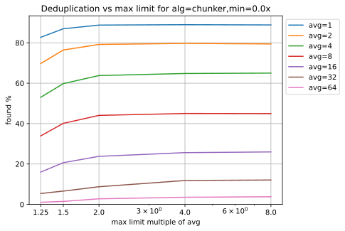

=============================
Chunker Performance Results
=============================

Overview
========

These are tests for different chunker distribution agorithms inspired by the
'normalized chunking' in FastCDC. They test only the chunker distribution
algorithms using a fast and flexible judgement criteria with a simulated
rollsum.

Rollsum Algorithms
------------------

These tests do not cover any rollsum implementations and simulate a rollsum as
producing a repeatable psedo-random stream of 32bit hashes. This should be
equivalent to an ideal rollsum, and allows the chunker distribution algorithms
to be assessed without being affected by weaknesses and degenerate cases in
real rollsum algorithms.

For a real rollsum there are several options. Testing and analysis of rollsums
can be found `here
<https://github.com/dbaarda/rollsum-tests/blob/master/RESULTS.rst>`_.
CyclicPoly (AKA BuzzHash) is strong and fast but requires a mapping table.
RabinKarp (AKA PolyHash) is stronger and probably just as fast.
RabinFingerPrint is strong but very slow using lookup tables to implement
GF(2) operations. Adler32/Fletcher-based (AKA bup or rollsum) are fast but
very very weak for small sliding windows. Gear is fast and avoids the need to
keep a sliding window, but requires a mapping table and is not very strong.

A common problem with many rollsums like Adler32 and Gear is the
most-significant-bits are stronger than the least-significant-bits. Many
chunking algorithms naively use the least-significant-bits for the judgement
criteria. FastCDC uses Gear together with a "zero-padding" judgement criteria
to try and overcome the weakness in the lower bits and effectively increase
the sliding window size.

For chunking, Gear is probably the fastest and good enough provided you use
the upper bits. If a stronger hash or larger sliding window is needed,
PolyHash would be better. Buzzhash is also fine, but probably not as good as
PolyHash.

Note I've seen many FastCDC implementations based on `ronomon/deduplication
<https://github.com/ronomon/deduplication>`_ that uses a right-shift instead
of a left shift, so that the least-significant-bits have more entropy and the
hash judgement doesn't need "zero-padding" of the mask. This might be
problematic because it means bytes don't fully "expire" from the hash, so
bytes from the very start of the block can modify the hash. This is because
addition in the Gear rollsum also propogates some bit changes upwards, so the
shift-right might never fully expire a byte out of the hash. In some ways this
improves the entropy of the hash, but it also means a change early in a chunk
can change the break point at the end, messing with resynchronisation. I filed
a `bug about it <https://github.com/ronomon/deduplication/issues/7>`_. In
retrospect it is probably OK, because the chance of a changed old byte
impacting on bits in the hash quickly approaches zero. However it's important
to note that it makes the least-significant-bits the strong ones. It should
probably be tested to see if this ends up being better than using a left-shift.

Hash Judgement
--------------

The FastCDC paper claims that `if !(hash & mask)` is measurably faster than
`if (hash % tgt_len) == criteria` for the hash judgement criteria. This may be
because `mod` operations are more expensive than `and` operations, but
provided tgt_len is a constant power of two most compilers should optimize it
to an `and` operation anyway. So most of the speed benefits must be because
under the hood the '!(...)' operation can simply check the zero-flag set by
the `and` operation, whereas `(...) == criteria` requires an extra comparison
operation.

In FastCDC they use a zero-padded mask to use higher bits of the Gear rollsum
to increase the sliding window size. However, we know that the Gear rollsum
includes more information in the most significant bits, so why not just use
the N most significant bits for a tgt_len=2^N expected size? It may be that
the bit selection they used avoids degenerate cases in the input or
byte->uint32 mapping they use, but I suspect not. Selecting the N most
significant bits can be done just as fast and simpler than FastCDC using a
shift::

  SHIFT = 32 - N
  
  if !(hash >> SHIFT):
    <it's a break point>

However comparing the hash to a threshold is also just as fast and capable of
arbitrary tgt_len sizes, not just powers of 2::

  THRESHOLD = 2^32 / tgt_len
  
  if (hash < THRESHOLD)
    <it's a break point>

This probably has stronger requirements for decent distribution of the hash
than a simple mask. In particular it requires that the top N bits of the hash
have a good distribution for tgt_len ~= 2^N. The Gear rollsum is known to not
have a great distribution for ASCII data, but fortunately the upper bits are
better, so it's probably OK for this purpose.

These tests use the "compare to a threshold' hash judgement since it's fast
and lets us test arbitrary target chunk lengths.

Chunk distribution
------------------

FastCDC pointed out that the simple chunker algorithm actually produces chunk
sizes with an exponential distribution that has average chunk size of
min_len+tgt_len, so the tgt_len, which many people call the average length, is
not really the average length.

FastCDC introduced their "normalized chunking" algorithm to give a better
approximation of a normal distribution, and claimed it allowed for larger
min_len with more cut-point-skipping for speed without adversely affecting
deduplication.

This idea inspired me to investigate even better ways of getting a more normal
distribution of chunk sizes, but unfortunatley the results show this is always
at the expense of duplication.

The primary factor for improving deduplication is the average chunk size.
Reducing the number of long chunks, or tightening the distribution curve, does
help too, but not if it messes with the boundary selection criteria. Things
like reducing max_len or changing the judgement criteria mess with
synchronisation after changes.

Chunking Algorithms
===================

Chunker
-------

This is the standard simple chunker with an exponential distribution. After
the min_len, there is a fixed probability that any could be a chunk boundary.
For tgt_len as the mean, the distribution's curves where x is measured from
min_len and L is the normal exponential distribution lambda parameter are::

    f(x) = L
    CDF(x) = 1 - e^-(L*x)
    PDF(x) = L*e^-(L*x)
    mean = C + 1/L*(1-e^-(L*T))

Where::

    L = 1/tgt_len
    C = min_len
    T = max_len - min_len

FastCDC
-------

This is the "normalized chunking" or NC2 described in the FastCDC paper.
The tgt_len for this chunker is the length where the probability steps up
from 1/4x to 4x the normal exponential distribution probablity. Note that
min_len doesn't offset this.

Weibull
-------

This was an idea inspired by FastCDC's "normalized chunking" to give an even
better approximation to a normal distribution using a "hazzard function" that
increases with block lenght as a function `f(x) = M * x^P`. This turns out to
be the same as a `Weibull Distribution
<https://en.wikipedia.org/wiki/Weibull_distribution>`_ with k=P+1. Note that
P=0 (AKA k=1) is identical to the normal Chunker exponential distribution. We
name these Weibull
 where P is the power used in the hazzard funciton.

WeibullT
--------

After initial tests showed that Weibull performed worse than Chunker with
large min_len values, I wondered if it would be better to "truncate" the
hazzard function to zero before min_len instead of shifting it and the
distribution to the right. This gives a modified Weibull distribution that
rises faster after min_len. This is identical to Weibull when min_len=0.  We
name these WeibullT
 where P is the power used in the hazzard funciton.

Testing
=======

Testing can be done using real-world usage tests, or synthetic simulation
tests. Real-world tests have the advantage of being representative of the
particular real-world use-case, but can be unrepresentative of other
real-world use-cases and are much harder to analyse. Synthetic tests can
specifically target known corner-cases and are much easier to analyse, making
it possible to more accurately assess the performance and make comparisons.

We use a synthetic test that generates a large 10000K run of initial "data",
which is then repeated with cyclic modifications. The modifications consist of
copy, insert, delete operations, with exponential random lengths of 16K, 8K,
and 4K, respectively. The test runs until at least 2x the initial data is
processed and the last block is completed. This ensures that there is no
fractional tail block to mess with the block-length stats, but does mean that
different runs might process slightly different amounts of data.

This means we know exactly how many duplicate bytes are in the data
(aproximately 33.3%) and can thus accurately measure how much duplication was
detected.

Results
=======

For each test we have the following variables;

* algorithm: The chunking algorithm used
* avg_len: The target average length
* min_len: The minimum length limit
* max_len: The maximum length limit

How average size varies with average target
------------------------------------------

The average size should be very close to the target average. If it deviates
significantly it would indicate that our tests have problematic biases or
insufficient random data. It also validates the maths we use for calculating
the target and average lengths.

.. image:: data/sizeavg-chunker-x-t-8.0.svg

.. image:: data/sizeavg-weibull1-x-t-8.0.svg

.. image:: data/sizeavg-weibullT1-x-t-8.0.svg

.. image:: data/sizeavg-weibullT2-x-t-8.0.svg

These show the average size is always within 1% of the target average. You can
also see it increases with the increasing target average. This is because for
the same data size, larger chunk sizes means less chunks, giving us less
random data, so there is more random noise.

How size stddev varies with min limit
-------------------------------------

This shows how the size distribution varies with the min limit.

We choose avg=1 and max=8x to get the most random data (most blocks) and
minimize the affect of trunctions.

.. image:: data/sizedev-t-1-x-8.0.svg

This shows how increasing min_len for a fixed avg_len also makes the
distribution "tighter". The downward gradient is steepest for the
"least-tight" chunker algorithm, which explains why increasing min_len
improves its deduplication so much; it significantly reduces the maximum chunk
sizes.

The chunker, weibull1 and weibull2 straight lines exactly match what the maths
says we should see for these distributions, further validating our maths and
implementation.

How deduplication varys with max limit
--------------------------------------

This measures how the max_len limit affects deduplication.

We use min_len = 0 as this maximizes the size spread for all the
distributions, highlighting the impact of max_len changes. Note WeibullT
distributions are identical to Weibull when min_len is zero so they are not
shown here.

.. image:: data/perf-weibull1-t-0.0-x.svg

.. image:: data/perf-weibull2-t-0.0-x.svg

These show that deduplication is worse when the max limit is small, and there
are diminishing benefits once you get past a certain size. The
"tighter" the distribution, the lower the point of diminshing returns. For
Weibull2 and FastCDC that point is at about 2x. For Weibull1 it's around 3x,
and for Chunker it's 4x.

This is what you would expect given that <2% of chunks are larger than these
multiples according to the CDP(x) functions for these distributions. 

How deduplication varys with min limit
--------------------------------------

This measures how the min_len limit affects deduplication.

We use max_len = 8x as this avoids the impact of max-length truncations.

.. image:: data/perf-weibull2-t-x-8.0.svg

.. image:: data/perf-weibullt1-t-x-8.0.svg

.. image:: data/perf-weibullt2-t-x-8.0.svg

These show that deduplication is worse when the max limit is small, and there
are diminishing benefits once you get past a certain size. The
"tighter" the distribution, the lower the point of diminshing returns. For
Weibull2 and FastCDC that point is at about 2x. For Weibull1 it's around 3x,
and for Chunker it's 4x.

This is what you would expect given that <2% of chunks are larger than these
multiples according to the CDP(x) functions for these distributions. 

How

Summary
=======

FastCDC is not better than simple chunking with the same minimum and average
chunk size. There is a better and as-fast hash judgement method. Simple
exponential chunking has better deduplication than normalized-chunking, and is
just as fast or faster with the same cut-point-skipping. The deduplication
benefits reported in the FastCDC paper are due to changes in the average chunk
size and distribution. The speed benefits are due to increasing the minimum
size limit (cut-point skipping). They never compared FastCDC against simple
exponential chunking for the same average and minimum chunk size. If you do,
it turns out simple exponential chunking gets better deduplication and is just
as fast or faster.

FastCDC's hash judgement cheking a random selection of hash bits are zero
should give a worse distribution and not be faster than using simple `hash <
threshold` comparision, where `threshold = 2^32/tgt_size`. This also allows
for arbitrary non-power-of-2 target sizes. The Gear rollsum has the largest
window-size (and thus most entropy and best distribution) in the most
significant bits, which are better utilized in a comparison against a
threshold than a random selection of (not all the most-significant) bits.

FastCDC's normalized chunking, or any kind of size distribution normalization,
has worse deduplication than simple exponential chunking with the same large
minimum size. Fancier normalization algorithms can give a more normal
distribution of chunk sizes, but this is always at the cost of deduplication.
Surprisingly exponential chunking gets better deduplication as the minimum
size is increased as a fraction of the average size. The optimal minimum size
is the exponential distribution's median or 41% of the average size (min_size
= 0.69*tgt_size), but 50% (min_size == tgt size) is nearly as good and gives
more cut-point-skipping speed benefits. Larger minimum sizes give even more
speed benefits, but the deduplication cost gets severe above about 66%
(min_size = 2*tgt_size). These minimum sizes are way larger than is typically
used with simple exponential chunking.
